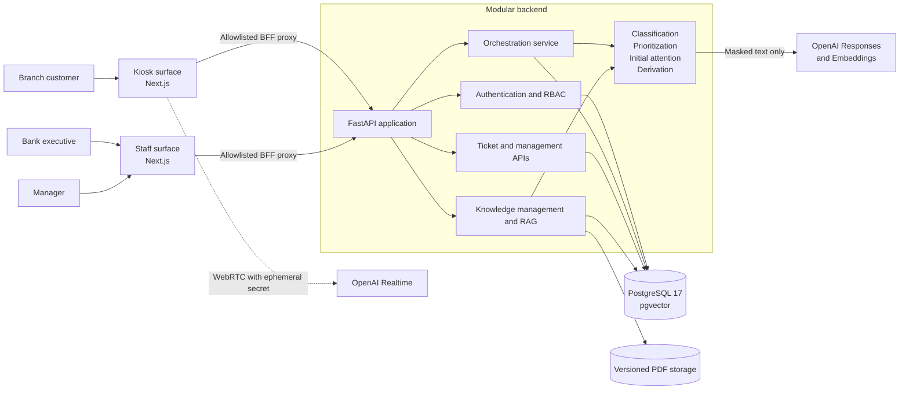
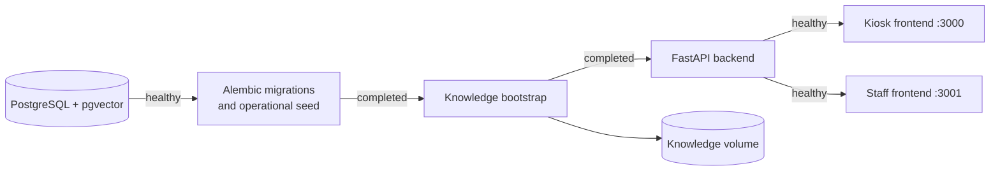
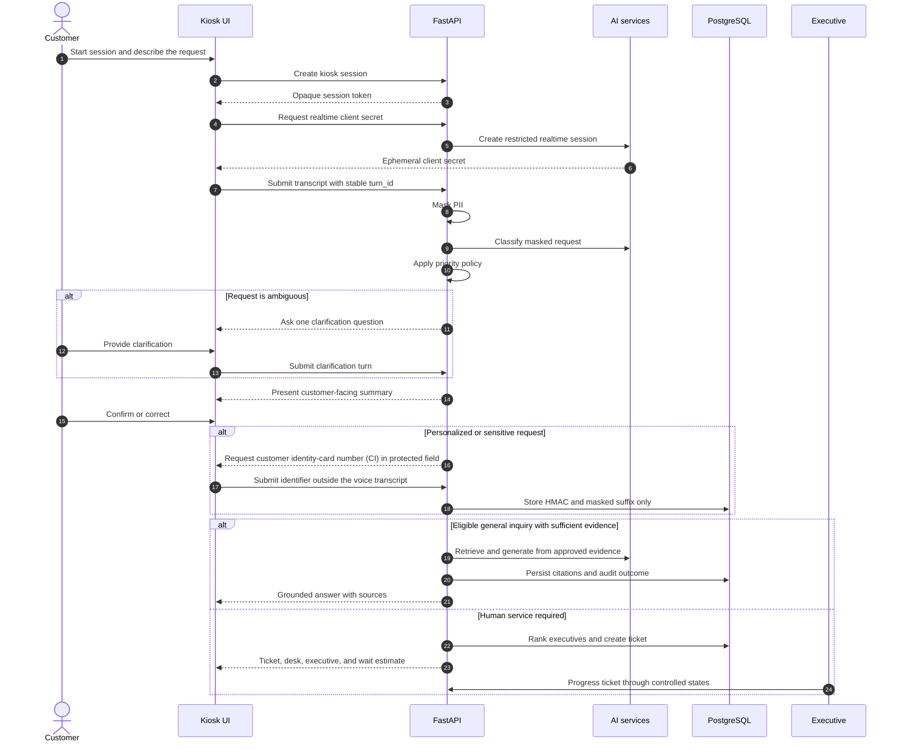
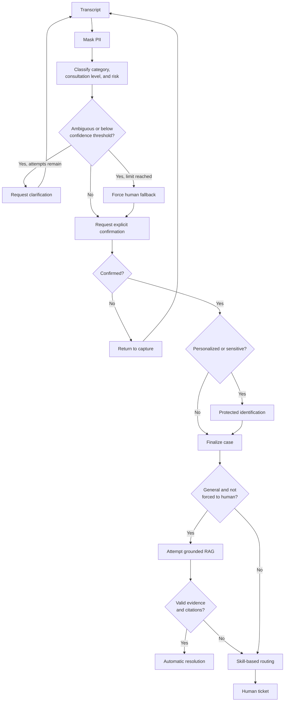
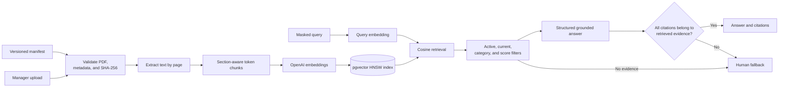

# Intelligent Banking Service Orchestration Platform

An AI-assisted branch service platform that turns a natural-language customer request into either a grounded self-service answer or a prioritized, skill-based assignment to a human executive.

The system combines a voice-enabled kiosk, an executive workspace, a management dashboard, and a governed document knowledge base. Its orchestration layer masks personally identifiable information (PII), classifies intent, requests clarification and confirmation, applies deterministic priority rules, protects customer identification, and preserves an auditable case timeline.

> The platform orchestrates customer-service workflows and does not execute financial transactions. Any production deployment must complete the institution's security, compliance, and operational approval processes.

## Table of contents

- [Product overview](#product-overview)
- [Key capabilities](#key-capabilities)
- [System architecture](#system-architecture)
- [Customer journey](#customer-journey)
- [Backend design](#backend-design)
- [Retrieval-augmented generation](#retrieval-augmented-generation)
- [Security and privacy](#security-and-privacy)
- [API overview](#api-overview)
- [Data model](#data-model)
- [Technology stack](#technology-stack)
- [Repository structure](#repository-structure)
- [Getting started](#getting-started)
- [Local development](#local-development)
- [Quality assurance](#quality-assurance)
- [Operational considerations](#operational-considerations)
- [Additional documentation](#additional-documentation)

## Product overview

The platform supports three distinct operational experiences backed by one API and one database:

| Experience | Purpose | Default URL |
| --- | --- | --- |
| Customer kiosk | Voice-led request capture, clarification, confirmation, protected identification, self-service answers, and ticket delivery | `http://localhost:3000` |
| Executive workspace | Authenticated queue, assigned-case details, trace history, and controlled ticket transitions | `http://localhost:3001/ejecutivo` |
| Management workspace | Operational KPIs, filtered case reporting, and governed knowledge-document lifecycle | `http://localhost:3001/gerencial` |

The kiosk and staff applications are built from the same Next.js image but run as isolated surfaces. `APP_SURFACE` selects the permitted route family, and the application fails closed with `404` for pages or proxied API paths that belong to the other surface.

## Key capabilities

- **Natural voice interaction** through OpenAI Realtime with Spanish transcription, semantic voice activity detection, interruptions, and short-lived browser credentials.
- **Privacy-first processing** that masks card numbers, account numbers, phone numbers, customer identifiers, monetary values, and names before classification or retrieval.
- **Structured request understanding** across card blocking, fraud reporting, general inquiries, credit requests, and digital banking.
- **Explicit human confirmation** before a case is created, including clarification and correction loops with idempotent turn handling.
- **Deterministic prioritization** based on category, urgency, security risk, distress signals, and preferential-attention policy.
- **Protected identification** for personalized and sensitive cases using an HMAC-derived identifier, masked display value, and a customer-reference registry.
- **Evidence-grounded answers** for eligible general inquiries using versioned PDF documents, pgvector retrieval, score thresholds, bounded context, and validated citations.
- **Human-in-the-loop fallback** whenever the request is sensitive, evidence is insufficient, grounding is invalid, the AI provider is unavailable, or classification remains ambiguous.
- **Skill-based case routing** that combines semantic fit, experience level, active workload, and deterministic tie-breaking.
- **Operational governance** through role-based access, ticket state transitions, optimistic concurrency, case trace events, management metrics, and document lifecycle controls.

## System architecture



### Deployment topology

Docker Compose defines an ordered startup pipeline. Migrations and deterministic operational seeding complete before knowledge ingestion, the API, and both frontend surfaces become available.



## Customer journey

The backend owns the business state machine. The realtime agent provides the conversational channel, while controlled tools delegate analysis, confirmation, identification, retrieval, and ticket creation to the API.



### Orchestration policy



## Backend design

The backend is a modular monolith: deployment remains simple, while API, domain, persistence, orchestration, AI-provider, and knowledge responsibilities stay explicitly separated.

| Module | Responsibility |
| --- | --- |
| `app/api` | HTTP contracts, dependency injection, kiosk session authorization, staff RBAC, pagination, and filters |
| `app/services/orchestrator.py` | Transactional workflow, state validation, idempotency, confirmation, identification, resolution, and routing |
| `app/services/agents.py` | Classification fallback, deterministic priority rules, evidence eligibility, and executive ranking |
| `app/services/openai_provider.py` | Structured model calls, embeddings, grounded generation, and realtime client-secret creation |
| `app/services/pii.py` | Local PII detection and masking before downstream AI processing |
| `app/knowledge` | PDF extraction, chunking, ingestion, retrieval, grounding validation, evaluation, and management lifecycle |
| `app/db` | Async SQLAlchemy models, repositories, session management, and idempotent operational seeding |
| `alembic` | Explicit, ordered schema migrations including pgvector and the HNSW vector index |

### Specialized orchestration components

| Component | Decision boundary |
| --- | --- |
| `ClassificationAgent` | Produces a validated structured category, consultation level, confidence, ambiguity status, customer-facing summary, and risk signals. A conservative local fallback is available in development. |
| `PrioritizationAgent` | Assigns `BAJO`, `MEDIO`, `ALTO`, or `CRITICO` through deterministic banking rules; preferential attention can raise non-high priorities by one level. |
| `InitialAttentionAgent` | Allows automatic answers only for `GENERAL` requests and only when `KnowledgeService` returns a grounded, naturally worded response. |
| `DerivationAgent` | Filters to available executives with the required category, then ranks by semantic match (70%), experience (20%), and workload (10%). |

Concurrency-sensitive kiosk operations lock the session row on PostgreSQL. Stable `turn_id` values, unique database constraints, recorded confirmation decisions, and one-ticket-per-case constraints make client retries safe. Ticket updates use an `expected_version` field and a closed transition graph:

```text
PENDIENTE -> EN_ATENCION -> CERRADO
```

## Retrieval-augmented generation

The knowledge subsystem is governed rather than open-ended. It indexes only registered PDF documents and refuses to answer when retrieval or citation validation fails.



An automatic response requires all of the following:

1. The request is classified as a general consultation and is not marked for forced human handling.
2. The query has already been masked.
3. Retrieved documents are active, within their review period, category-compatible, and above the configured similarity threshold.
4. The prompt context stays within the configured token budget.
5. The model returns a supported structured response with at least one citation.
6. Every cited chunk belongs to the exact retrieved evidence set.

Every retrieval attempt records its outcome, prompt version, retrieved chunk metadata, and an answer hash when applicable. The raw generated answer is not duplicated in the RAG audit record.

Managers can list, upload, update, version, download, reindex, and archive knowledge documents. Upload validation covers PDF signature, MIME type, file size, page count, extractable text, category metadata, and HTTP(S) source URLs; stored objects use generated UUID keys instead of user-supplied filenames.

## Security and privacy

The implementation applies defense-in-depth controls appropriate to the project scope:

- Raw audio is handled by the realtime channel and is not persisted by the application.
- Original audio and unmasked transcripts are not stored. Completed dialogue messages are masked again by the backend, retained for 90 configurable days, and then purged automatically.
- PINs, CVVs, passwords, credentials, and complete financial data are explicitly prohibited in realtime and grounded-answer instructions.
- The regular OpenAI API key never reaches the browser. The browser receives only a short-lived realtime client secret tied to the kiosk session.
- Kiosk access uses a high-entropy opaque token; only its SHA-256 hash is stored, and every protected kiosk route validates expiry.
- Customer identity-card numbers (CI) keep the HMAC-SHA-256 digest and masked suffix, plus an AES-256-GCM encrypted value protected by a versioned key. Only the assigned executive can reveal it, and every reveal is audited.
- Staff passwords use the recommended Argon2 password hash.
- Staff access uses short-lived HS256 JWTs. Opaque refresh tokens are stored as hashes, rotated on use, revocable, and delivered through `HttpOnly`, `SameSite=Lax` cookies (`Secure` in production).
- RBAC separates `EXECUTIVE` and `MANAGER`. Executives can access only their assigned tickets and reveal only those identifiers; managers receive masked, read-only case files, reporting, and knowledge-management permissions.
- Ticket transitions are allowlisted and guarded by optimistic concurrency. A partial unique constraint permits only one active attendance per executive, and closing requires a structured outcome and protected note.
- API errors share a stable contract with `code`, `message`, `details`, and `trace_id`; structured request logs include the same trace correlation header.
- Login, kiosk-session creation, and realtime-token creation have basic per-process rate limits.
- Application settings validate secret length, CORS origins, vector dimensions, retrieval limits, and mandatory AI configuration in production.

## API overview

All versioned endpoints are exposed under `/api/v1`. Interactive OpenAPI documentation is available at `http://localhost:8000/docs`.

| Area | Representative endpoints | Access model |
| --- | --- | --- |
| Health | `GET /health/live`, `GET /health/ready` | Public |
| Public configuration | `GET /system/public-config` | Public |
| Staff authentication | `POST /auth/login`, `POST /auth/refresh`, `POST /auth/logout`, `GET /auth/me` | Credentials, refresh cookie, or bearer token |
| Kiosk workflow | `POST /kiosk/sessions`, turns, confirmation, identification, conversation-message synchronization, and session status | Opaque `X-Session-Token` after creation |
| Realtime voice | `POST /kiosk/sessions/{id}/realtime-token` | Opaque `X-Session-Token` |
| Executive operations | Filtered `GET /executive/tickets`, `GET /tickets/{id}`, status transitions, and identifier reveal | Executive bearer token; managers have masked read-only ticket-detail access |
| Management reporting | `GET /management/metrics`, `GET /management/cases` | Manager bearer token |
| Knowledge governance | `/management/knowledge/documents` and document version, reindex, download, and archive operations | Manager bearer token |

The two Next.js surfaces call these endpoints through `/backend-api/api/v1/...`, a same-origin backend-for-frontend proxy that forwards only the API families allowlisted for the active surface.

## Data model


Schema evolution is managed by six explicit Alembic revisions covering the operational model, pgvector knowledge schema, production hardening fields, the customer/operational registry, the natural kiosk flow, and the protected staff case file.

## Technology stack

| Layer | Technologies |
| --- | --- |
| Frontend | Next.js 16, React 19, TypeScript, Tailwind CSS 4, Recharts, OpenAI Agents SDK, Zod |
| Backend | Python 3.12, FastAPI, Pydantic 2, SQLAlchemy 2 async, Uvicorn, Structlog |
| AI | OpenAI Realtime, structured Responses API calls, text embeddings |
| Data | PostgreSQL 17, pgvector, HNSW cosine index, Alembic |
| Security | Argon2, JWT access tokens, rotating opaque refresh tokens, HMAC identifier protection |
| Tooling | Docker Compose, `uv`, `pnpm`, Ruff, Pytest, Vitest, ESLint |

## Repository structure

```text
.
├── backend/
│   ├── alembic/                 # Versioned database migrations
│   ├── app/
│   │   ├── api/                 # FastAPI routers and access dependencies
│   │   ├── core/                # Configuration, errors, security, time helpers
│   │   ├── db/                  # Models, repositories, sessions, operational seed
│   │   ├── domain/              # Enums and Pydantic contracts
│   │   ├── knowledge/           # Ingestion, retrieval, RAG, document management
│   │   └── services/            # Orchestrator, agents, PII, OpenAI provider
│   ├── seed/                    # Deterministic branch and executive catalog
│   └── tests/                   # Backend unit and integration suite
├── frontend/
│   ├── app/                     # Kiosk, executive, and management routes
│   ├── components/              # Product and UI components
│   ├── lib/                     # API client, realtime logic, domain types
│   └── tests/                   # Surface isolation and realtime behavior tests
├── doc/
│   ├── rag/                     # Governed source PDFs and manifest
│   └── operacion/               # Generated operational documentation
├── docker-compose.yml           # Complete local topology and startup ordering
└── .env.example                 # Compose-level configuration template
```

## Getting started

### Prerequisites

- Docker Engine with Docker Compose v2
- An OpenAI API key for realtime voice, model-based classification, embeddings, and grounded answers
- Available local ports `3000`, `3001`, `8000`, and `5432` (or custom values in `.env`)

### 1. Create local configuration

```bash
cp .env.example .env
cp backend/.env.example backend/.env
```

Replace every placeholder password and secret in both files. At minimum, configure:

```dotenv
# .env
POSTGRES_DB=orquestacion
POSTGRES_USER=orquestacion
POSTGRES_PASSWORD=<strong-local-database-password>

# backend/.env
OPENAI_API_KEY=<your-api-key>
JWT_SECRET=<at-least-32-random-characters>
IDENTIFIER_PEPPER=<a-different-random-secret>
SEED_EXECUTIVE_PASSWORD=<at-least-12-characters>
SEED_MANAGER_PASSWORD=<at-least-12-characters>
```

Do not commit `.env` files or expose `OPENAI_API_KEY`. The configured `KIOSK_FRONTEND_ORIGIN` and `STAFF_FRONTEND_ORIGIN` must match the browser-visible origins, including deployments behind reverse proxies.

### 2. Start the platform

```bash
docker compose up --build --remove-orphans
```

On the first run, Compose creates the database, applies all migrations, loads the operational registry, indexes the manifest-managed knowledge corpus when `OPENAI_API_KEY` is present, starts the API, and then exposes both frontend surfaces.

### 3. Verify the deployment

```bash
docker compose ps
curl http://localhost:8000/api/v1/health/ready
curl -I http://localhost:3000/
curl -I http://localhost:3001/
```

Expected behavior:

- Port `3000` redirects `/` to `/kiosco`.
- Port `3001` redirects `/` to `/login`.
- The readiness endpoint returns `{"status":"ready"}` after PostgreSQL is reachable.
- API documentation is available at `http://localhost:8000/docs`.

Operational users are seeded from `backend/seed/operational_seed.json`; their passwords come exclusively from `SEED_EXECUTIVE_PASSWORD` and `SEED_MANAGER_PASSWORD`.

## Local development

### Backend

Run PostgreSQL with the `vector` extension, then execute from `backend/`:

```bash
uv sync
uv run alembic upgrade head
uv run python -m app.db.seed
uv run python -m app.knowledge.cli ingest
uv run uvicorn app.main:app --reload
```

The backend reads `backend/.env`. `DATABASE_URL` is used by the async application, while `DATABASE_MIGRATION_URL` can provide a separate migration connection.

Knowledge-base operations:

```bash
uv run python -m app.knowledge.cli ingest
uv run python -m app.knowledge.cli status
uv run python -m app.knowledge.cli evaluate
```

`ingest` validates the manifest and content hashes, extracts and chunks PDFs, creates embeddings, updates document versions, and backfills executive-skill embeddings. `evaluate` runs retrieval cases and verifies that policy-ineligible requests are not answered automatically.

### Frontend

Run either development surface from `frontend/`:

```bash
pnpm install --frozen-lockfile
APP_SURFACE=kiosk BACKEND_INTERNAL_URL=http://localhost:8000 pnpm dev
```

```bash
PORT=3001 APP_SURFACE=staff BACKEND_INTERNAL_URL=http://localhost:8000 pnpm dev
```

Run one surface at a time when using the shared local `.next` directory. Use Docker Compose to run both isolated surfaces simultaneously.

## Quality assurance

The backend suite covers kiosk state transitions, ambiguity and correction loops, idempotent retries, protected identification, priority rules, PII masking, role boundaries, refresh rotation, realtime-secret containment, RAG ingestion and grounding, executive routing, management metrics, and knowledge-document lifecycle.

Run backend validation from `backend/`:

```bash
uv run ruff format --check .
uv run ruff check .
uv run pytest -q
uv run --with pip-audit pip-audit
```

Run frontend validation from `frontend/`:

```bash
pnpm lint
pnpm typecheck
pnpm test
pnpm build
```

The test environment uses an isolated ephemeral SQLite schema and deterministic AI doubles; automated tests do not call OpenAI.

## Operational considerations

The included Compose topology is designed for reproducible local evaluation. Before a production deployment:

- Terminate TLS at a trusted reverse proxy and configure the exact public CORS origins.
- Store database credentials, `JWT_SECRET`, `IDENTIFIER_PEPPER`, seed passwords, and the OpenAI key in a managed secret store.
- Replace the in-process rate limiter with a shared, distributed limiter when running multiple API replicas.
- Add centralized log aggregation, metrics, alerting, retention rules, and trace propagation to downstream services.
- Define PostgreSQL backup, restore, migration rollback, and knowledge-file durability procedures.
- Review document approval and expiry policies, identity-verification rules, and data retention with the relevant security and compliance teams.
- Run dependency auditing and all backend/frontend quality gates in CI.

When OpenAI is intentionally absent in development, deterministic classification fallback remains available, realtime voice returns a controlled `503`, and RAG safely routes the case to a human. Production configuration rejects a missing OpenAI key at startup.

## Additional documentation

- [Backend implementation guide](backend/README.md)
- [Implementation audit](doc/AUDITORIA_IMPLEMENTACION.md)
- [Backend architecture audit (PDF)](doc/auditoria_backend_arquitectura.pdf)
- [Governed RAG manifest](doc/rag/manifest.json)
