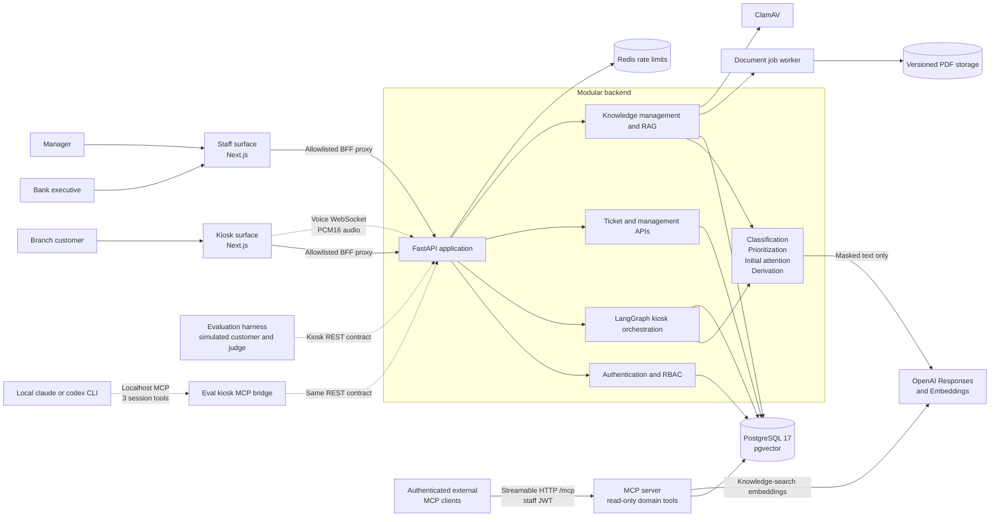
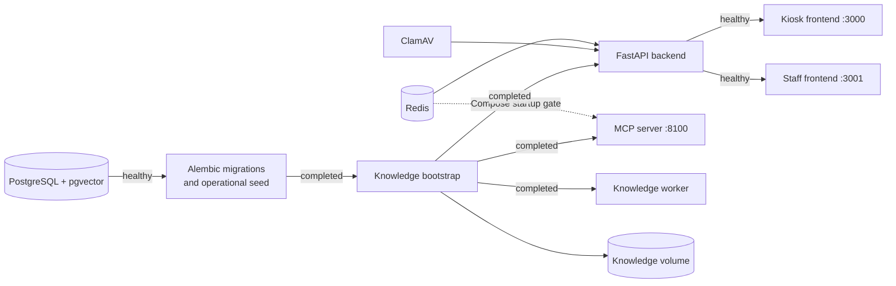
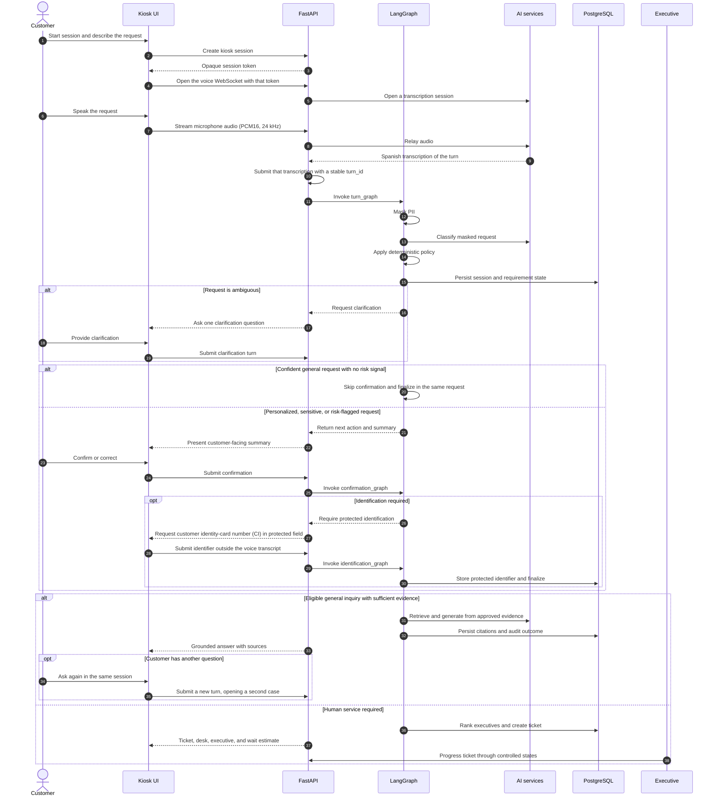
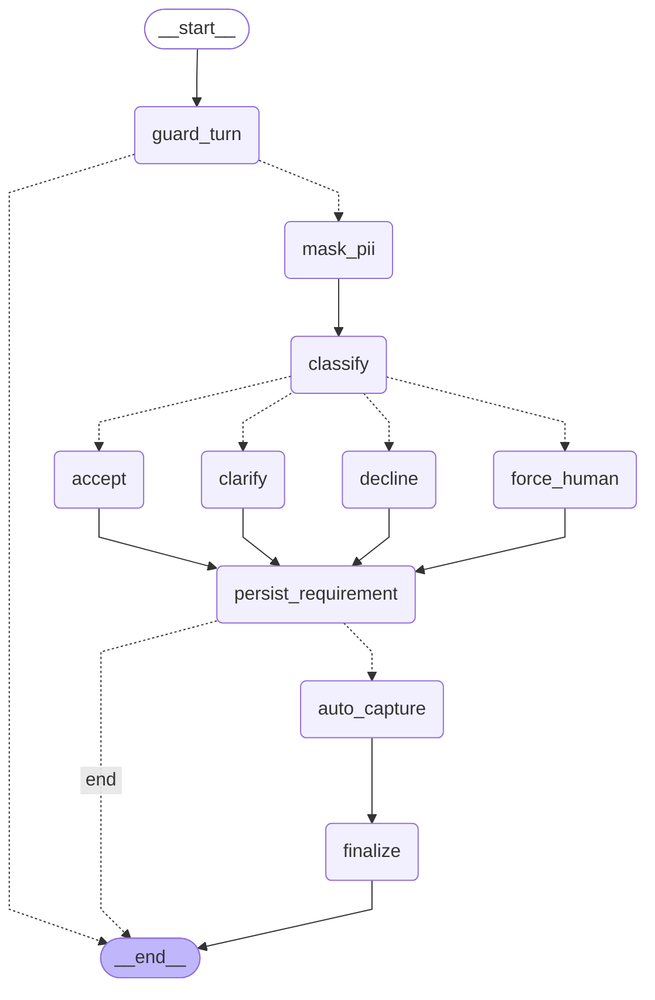
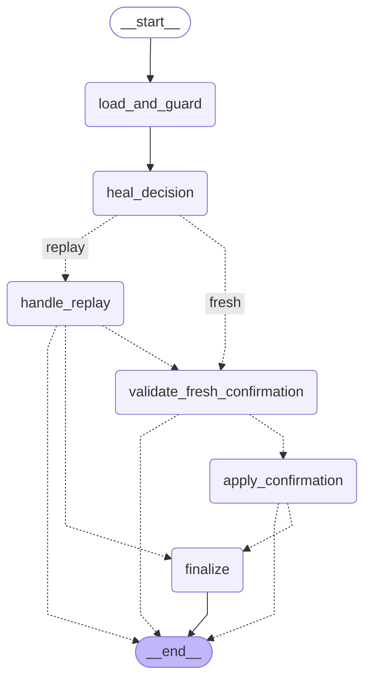
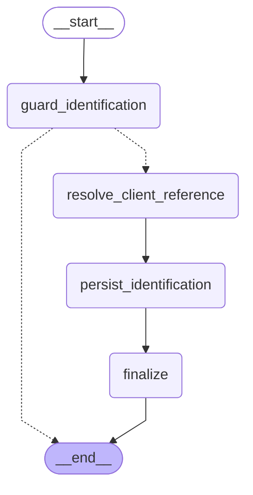
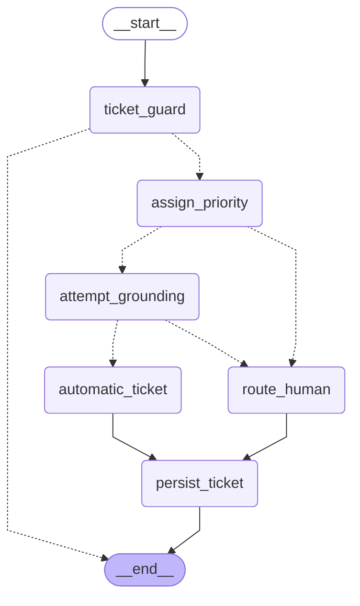
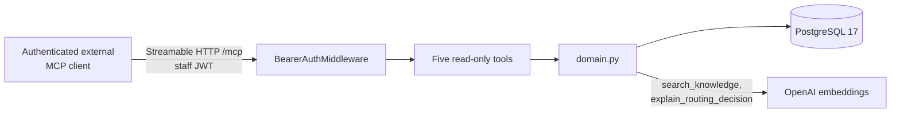
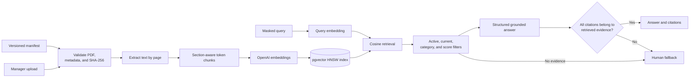
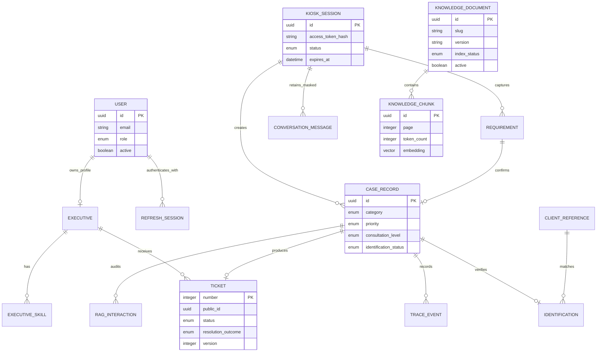

# Intelligent Banking Service Orchestration Platform

An AI-assisted branch service platform that turns a natural-language customer request into either a grounded self-service answer or a prioritized, skill-based assignment to a human executive.

The system combines a voice-enabled kiosk, an executive workspace, a management dashboard, and a governed document knowledge base. Its orchestration layer masks personally identifiable information (PII), classifies intent, requests clarification and confirmation, applies deterministic priority rules, protects customer identification, and preserves an auditable case timeline.

> The platform orchestrates customer-service workflows and does not execute financial transactions. Any production deployment must complete the institution's security, compliance, and operational approval processes.

## Table of contents

- [Product overview](#product-overview)
- [Key capabilities](#key-capabilities)
- [System architecture](#system-architecture)
- [Customer journey](#customer-journey)
- [Backend design](#backend-design)
- [MCP servers](#mcp-servers)
- [Retrieval-augmented generation](#retrieval-augmented-generation)
- [Security and privacy](#security-and-privacy)
- [API overview](#api-overview)
- [Data model](#data-model)
- [Technology stack](#technology-stack)
- [Repository structure](#repository-structure)
- [Getting started](#getting-started)
- [Local development](#local-development)
- [Quality assurance](#quality-assurance)
- [Operational considerations](#operational-considerations)
- [Additional documentation](#additional-documentation)

## Product overview

The platform supports three distinct operational experiences backed by one API and one database:

| Experience | Purpose | Default URL |
| --- | --- | --- |
| Customer kiosk | Voice-led request capture, clarification, confirmation, protected identification, self-service answers, and ticket delivery | `http://localhost:3000` |
| Executive workspace | Authenticated queue, assigned-case details, trace history, and controlled ticket transitions | `http://localhost:3001/ejecutivo` |
| Management workspace | Operational KPIs, filtered case reporting, and governed knowledge-document lifecycle | `http://localhost:3001/gerencial` |

The kiosk and staff applications are built from the same Next.js image but run as isolated surfaces. `APP_SURFACE` selects the permitted route family, and the application fails closed with `404` for pages or proxied API paths that belong to the other surface.

## Key capabilities

- **Voice-first accessible interaction** over a backend-brokered WebSocket: streaming Spanish recognition, barge-in, live captions, and an always-available text alternative. Speech recognition and synthesis are separate steps around the ordinary orchestrator, so there is exactly one transcript and no model positioned to reword it. No OpenAI credential ever reaches the browser.
- **Privacy-first processing** that masks card numbers, account numbers, phone numbers, customer identifiers, monetary values, and names before classification or retrieval.
- **Structured request understanding** across card blocking, fraud reporting, general inquiries, credit requests, and digital banking.
- **Confirmation where confirmation is worth its cost**: a general question the kiosk is about to answer itself resolves in one turn, while anything personalized, sensitive, or flagged as a risk still has its summary read back before a case exists. Clarification and correction loops are bounded and idempotent per `turn_id`.
- **Deterministic safety floors over the classifier**, so an intermittently over-confident `GENERAL` label cannot skip identification or escalation on a request about the customer's own money.
- **Multi-need sessions**: a follow-up question after an automatic answer opens its own case and ticket instead of being rejected, so someone who asks two things gets two answers.
- **Deterministic prioritization** based on category, urgency, security risk, distress signals, and preferential-attention policy.
- **Protected identification** for personalized and sensitive cases using an HMAC-derived identifier, masked display value, and a customer-reference registry.
- **Evidence-grounded answers** for eligible general inquiries using versioned PDF documents, pgvector retrieval, score thresholds, bounded context, and validated citations.
- **Human-in-the-loop fallback** whenever the request is sensitive, evidence is insufficient, grounding is invalid, the AI provider is unavailable, or classification remains ambiguous.
- **Skill-based case routing** that combines semantic fit, experience level, active workload, and deterministic tie-breaking.
- **Operational governance** through role-based access, optimistic concurrency, audited assignment and priority controls, executive availability, queue and SLA metrics, and asynchronous document lifecycle controls.

## System architecture



The MCP server is a second ASGI process on its own port, sharing the backend's domain
code and PostgreSQL database without becoming part of the kiosk request path. The kiosk,
staff surfaces, and the evaluation harness all reach the backend over REST; authenticated
external MCP clients use `/mcp`. The harness runs a second, unrelated MCP server of its own
so a local coding-agent CLI can play the customer -- see
[MCP servers](#mcp-servers) for how the two differ.

### Deployment topology

Docker Compose defines an ordered startup pipeline. Migrations and deterministic operational seeding complete before knowledge ingestion, the API, and both frontend surfaces become available.



## Customer journey

The backend owns the business state machine, and the voice channel is a transport around it rather than a second implementation of it. A spoken turn is recognised, handed to the same `analyze_turn` the text kiosk and the evaluation harness call, and the answer the orchestrator produced is synthesised back as speech.

No language model sits between the recogniser and the classifier. The text that is masked, classified, prioritised and routed is the transcript the recogniser produced, which is also what the live captions show — so what the customer reads on screen is what the case was opened from. Everything the kiosk says is backend-authored text passed verbatim to speech synthesis; no model is ever asked to compose customer-facing wording.



### Orchestration policy

The kiosk flow is implemented as three [LangGraph](https://github.com/langchain-ai/langgraph)
graphs (`app/services/graph/`), one per API entry point, sharing a compiled `finalize`
subgraph. The diagrams below are generated directly from the compiled graphs via
`graph.get_graph().draw_mermaid()` -- from `backend/`, run
`PYTHONPATH=. uv run python scripts/render_graph_diagrams.py` after any change to
`app/services/graph/*.py` to regenerate this section, so it cannot drift from the
implementation. Dashed edges are dynamic `Command`-based routing (guard and
replay-idempotency branches, e.g. an already-completed turn short-circuiting to its cached
result); solid edges are static and dashed-with-labels are conditional policy branches.

No LangGraph checkpointer is used: each HTTP request is already the unit of work, and
`SessionStatus` on the `kiosk_sessions` row -- read under `SELECT ... FOR UPDATE` on
PostgreSQL -- is the durable, queryable record of where a session is in the flow. See the
module docstring in `app/services/graph/state.py` for the full reasoning.

The application imports LangGraph directly. LangChain Core provides the underlying graph
runtime abstractions through LangGraph's dependency tree; there is no separate LangChain
agent layer in the kiosk.

#### When the kiosk answers without asking

`turn_nodes.requires_confirmation` decides whether a turn stops at `AWAITING_CONFIRMATION`
or resolves inside the same HTTP request. Confirmation is friction that only earns its keep
when something irreversible follows -- identification, or a human handoff -- and `GENERAL`
is exactly the consultation level that needs neither: its case is always `ANONIMO`, and it
is the only level `InitialAttentionAgent` will ground at all. A confident `GENERAL`
classification therefore skips the round-trip and `turn_graph` reaches the shared `finalize`
subgraph itself, through `accept -> persist_requirement -> auto_capture`. The turn responds
`next_action: COMPLETE` carrying the full result -- answer and citations, or ticket, desk and
wait estimate -- instead of a summary to confirm.

Two independent signals have to agree before a session resolves itself that way. The eval
run of 2026-08-18 has the classifier returning `GENERAL` at 0.99 confidence for *"me robaron
mi tarjeta de debito"* while its own `security_incident` and `distress_detected` flags said
the opposite, so either risk flag -- or a `REPORTE_FRAUDE` category -- forces the
confirmation step whatever the level says. `backend/scripts/probe_classifier.py` replays
recorded openers through the classifier to measure how often a label actually flips, rather
than inferring stability from a single eval run.

#### Deterministic floors over the classifier

`agents.sensitivity_floor()` derives, from the masked text alone, the lowest consultation
level a request may be treated as: a fraud report, an incident that has already happened
("me robaron", "no reconozco"), the customer's own banking objects, or their own file and
access. `ClassificationAgent._enforce_sensitivity` applies it as a floor that only ever
*raises* the model's answer -- the classification source becomes `MODEL+FLOOR` -- and never
lowers it. Over-classification costs one confirmation turn; under-classification costs
identification and human escalation outright. The keyword tables are shared with the offline
fallback, so a floor and the fallback it mirrors cannot drift apart.

Both loop counters are bounded, and neither ends in a dead session. When the clarification
budget (`MAX_CLARIFICATIONS`) runs out, `force_human` drops the level to `GENERAL` -- asking
for an identity card for a request nobody understood is the over-identification the policy
forbids -- but keeps the *category*, which is what `PrioritizationAgent` and `DerivationAgent`
read. When the correction budget (`MAX_CORRECTIONS`, default 2) runs out, the requirement is
marked `force_human`, a `CORRECTION_LIMIT_REACHED` trace event is recorded, and the case goes
straight to an executive with what was understood so far.

<!-- BEGIN GENERATED GRAPH DIAGRAMS -->

#### `turn_graph`

Handles `POST /kiosk/sessions/{id}/turns`. `finalize` is the shared subgraph below: a confident GENERAL classification reaches it through `auto_capture` without a confirmation round-trip (see `turn_nodes.requires_confirmation`).



#### `confirmation_graph`

Handles `POST /kiosk/sessions/{id}/confirmation`. `finalize` is the same compiled subgraph `turn_graph` and `identification_graph` use.



#### `identification_graph`

Handles `POST /kiosk/sessions/{id}/identification`.



#### `finalize_subgraph`

Compiled once in `builder.py` and added as the `finalize` node to all three graphs above -- the same compiled instance, not a copy.


<!-- END GENERATED GRAPH DIAGRAMS -->

## Backend design

The backend is a modular monolith: deployment remains simple, while API, domain, persistence, orchestration, AI-provider, and knowledge responsibilities stay explicitly separated.

| Module | Responsibility |
| --- | --- |
| `app/api` | HTTP contracts, dependency injection, kiosk session authorization, staff RBAC, pagination, and filters |
| `app/services/orchestrator.py` | Thin adapter: session locking, invoking the LangGraph graphs below, and shaping their final state into API responses |
| `app/services/graph` | The state machine itself -- turn/confirmation/identification graphs, the shared `finalize` subgraph, the auto-resolve branch, guard and idempotency logic (see [Orchestration policy](#orchestration-policy)) |
| `app/services/agents.py` | Classification fallback, the deterministic sensitivity floor over the classifier, priority rules, evidence eligibility, and executive ranking |
| `app/services/openai_provider.py` | Structured model calls, embeddings, grounded generation, speech recognition sessions, and speech synthesis |
| `app/services/pii.py` | Local PII detection and masking before downstream AI processing |
| `app/knowledge` | PDF extraction, chunking, ingestion, retrieval, grounding validation, evaluation, and management lifecycle |
| `app/mcp_server` | Read-only MCP tools for authenticated external clients -- bearer-authenticated, streamable-HTTP, never called by the frontends (see [MCP servers](#mcp-servers)) |
| `app/db` | Async SQLAlchemy models, repositories, session management, and idempotent operational seeding |
| `alembic` | Explicit, ordered schema migrations including pgvector and the HNSW vector index |
| `scripts/` | Operational scripts: OpenAPI export, graph-diagram rendering, operational-document rendering, pre-eval queue reset, classifier stability probe |
| `evals/` (standalone project) | 42-scenario harness and LLM judge scoring policy compliance and service quality against a live backend; own venv, not part of the modular backend (see [Quality assurance](#quality-assurance)) |

### Specialized orchestration components

| Component | Decision boundary |
| --- | --- |
| `ClassificationAgent` | Produces a validated structured category, consultation level, confidence, ambiguity status, customer-facing summary, and risk signals. A deterministic floor may raise the consultation level it returned, never lower it; a conservative local keyword fallback covers a provider outage. |
| `PrioritizationAgent` | Assigns `BAJO`, `MEDIO`, `ALTO`, or `CRITICO` through deterministic banking rules; preferential attention can raise non-high priorities by one level. |
| `InitialAttentionAgent` | Allows automatic answers only for `GENERAL` requests and only when `KnowledgeService` returns a grounded, naturally worded response. |
| `DerivationAgent` | Filters to available executives with the required category, then ranks by semantic match (70%), experience (20%), and workload (10%). |

Concurrency-sensitive kiosk operations lock the session row on PostgreSQL. Stable `turn_id` values, unique database constraints, recorded confirmation decisions, and one-ticket-per-case constraints make client retries safe. Ticket updates use an `expected_version` field and a closed transition graph:

```text
PENDIENTE -> EN_ATENCION -> CERRADO
```

## MCP servers

This repository contains two MCP servers with nothing in common but the protocol. Keeping
them straight matters, because one is part of the product and the other exists only while a
test run is in flight.

| | `backend/app/mcp_server/` | `backend/evals/harness/mcp_kiosk_server.py` |
| --- | --- | --- |
| Purpose | Read-only domain access for external MCP clients | Lets a local `claude` / `codex` CLI drive a live kiosk session as the simulated customer |
| Tools | Five, all read-only | Three: `send_turn`, `send_confirmation`, `send_identification` -- the same bound methods the AutoGen customer agent calls |
| Process | Own ASGI application on port `8100` | In-process, ephemeral localhost port, pooled for the length of one eval run |
| Authentication | Staff JWT through `BearerAuthMiddleware` | None -- reachable only by the CLI subprocess the harness just spawned on the same machine |
| Ships to production | Yes | No; it lives in the standalone eval project |

The rest of this section is about the first one.

### Read-only domain tools (`app/mcp_server/`)

`app/mcp_server/` runs as a second ASGI application (`python -m app.mcp_server`, port
`8100`) using the backend image and domain code but a separate process and database
connection pool. It exposes five read-only tools over MCP's streamable-HTTP transport to
authenticated external MCP clients. The kiosk and staff frontends call the typed REST API,
and so does the [evaluation harness](backend/evals/README.md), whose scenarios exercise that
same kiosk REST contract. The LangGraph nodes never call MCP.

| Tool | Returns |
| --- | --- |
| `search_knowledge` | pgvector evidence for a query, scoped to a category -- fragments with citation and similarity score, never a generated answer |
| `get_case_trace` | The auditable `TraceEvent` timeline for a case, PII-masked |
| `list_executive_availability` | Available executives, active workload, and category skills |
| `get_ticket_status` | Ticket status, priority, estimated wait, and assigned executive -- never the customer identifier |
| `explain_routing_decision` | Recomputes `DerivationAgent`'s full ranking (semantic match 70%, experience 20%, workload 10%) without mutating the case |



Authentication reuses the same JWT and role model as the staff REST API
(`decode_access_token`, `UserRole.EXECUTIVE` / `UserRole.MANAGER`) rather than a parallel
scheme. The check is inlined as raw ASGI middleware (`app/mcp_server/auth.py`) instead of
Starlette's `BaseHTTPMiddleware`, which buffers the response body and is unsafe for MCP's
streaming transport. The server never exposes kiosk-session mutation or identifier
reveal -- those operations stay exclusive to the authenticated REST API.

Run it locally alongside the backend:

```bash
cd backend
uv run python -m app.mcp_server
curl http://localhost:8100/healthz
```

After obtaining an executive or manager access token through the REST authentication
API, configure the MCP client to connect to `http://localhost:8100/mcp` with
`Authorization: Bearer <access-token>`.

### Eval kiosk bridge (`evals/harness/mcp_kiosk_server.py`)

The evaluation harness can put a local coding-agent CLI (`claude -p`, `codex exec`) in the
customer's seat instead of an OpenAI model. Neither CLI accepts caller-defined tools as a
request parameter the way the Chat Completions API does, but both run an agentic tool loop
against an MCP server, so the harness stands up its own: three tools --
`send_turn`, `send_confirmation`, `send_identification` -- wrapping the exact bound methods
the AutoGen customer agent already calls, with the same 12-call budget. `serve_kiosk_pool`
keeps a small pool of these servers alive for the whole run rather than rebuilding one per
scenario; `serve_kiosk_tools` binds a single server to a single session and is what the
harness's own tests exercise against a real MCP client.

It is localhost-only and unauthenticated by design: the only thing that can reach it is the
CLI subprocess the harness spawned seconds earlier on the same machine. It never runs outside
an eval run, and it is not part of the deployed system. See
[Running on a local CLI instead of OpenAI](backend/evals/README.md#running-on-a-local-cli-instead-of-openai).

## Retrieval-augmented generation

The knowledge subsystem is governed rather than open-ended. It indexes only registered PDF documents and refuses to answer when retrieval or citation validation fails.



An automatic response requires all of the following:

1. The request is classified as a general consultation and is not marked for forced human handling.
2. The query has already been masked.
3. Retrieved documents are active, within their review period, category-compatible, and above the configured similarity threshold.
4. The prompt context stays within the configured token budget.
5. The model returns a supported structured response with at least one citation.
6. Every cited chunk belongs to the exact retrieved evidence set.

Every retrieval attempt records its outcome, prompt version, retrieved chunk metadata, and an answer hash when applicable. The raw generated answer is not duplicated in the RAG audit record.

The corpus itself is eight manifest-managed PDFs (`doc/rag/`), currently at version
`2026.08.1` -- regenerated in August 2026 with the sections the eval runs showed missing
(agency hours, accounts for minors, periodic-payment deposits, among others), each with a
fresh `sha256`, `verified_at`, and `review_after` date that the ingestion CLI verifies before
indexing.

Managers can list, upload, update, version, download, reindex, and archive knowledge documents. Upload validation covers PDF signature, MIME type, file size, page count, extractable text, category metadata, and HTTP(S) source URLs; stored objects use generated UUID keys instead of user-supplied filenames.

## Security and privacy

The implementation applies defense-in-depth controls appropriate to the project scope:

- Raw audio is relayed to the recogniser and back to the browser and is never written to disk or to the database.
- Original audio and unmasked transcripts are not stored. Completed dialogue messages are masked again by the backend, retained for 90 configurable days, and then purged automatically.
- PINs, CVVs, passwords, credentials, and complete financial data are explicitly prohibited in the classification and grounded-answer instructions.
- No OpenAI credential of any kind reaches the browser. Recognition and synthesis both run server-side; the browser holds only the opaque kiosk session token.
- Kiosk access uses a high-entropy opaque token; only its SHA-256 hash is stored, and every protected kiosk route validates expiry.
- Customer identity-card numbers (CI) keep the HMAC-SHA-256 digest and masked suffix, plus an AES-256-GCM encrypted value protected by a versioned key. Only the assigned executive can reveal it, and every reveal is audited.
- Staff passwords use the recommended Argon2 password hash.
- Staff access uses short-lived HS256 JWTs. Opaque refresh tokens are stored as hashes, rotated on use, revocable, and delivered through `HttpOnly`, `SameSite=Lax` cookies (`Secure` in production).
- RBAC separates `EXECUTIVE` and `MANAGER`. Executives can access only their assigned tickets and reveal only those identifiers; managers receive masked, read-only case files, reporting, and knowledge-management permissions.
- Ticket transitions are allowlisted and guarded by optimistic concurrency. A partial unique constraint permits only one active attendance per executive, and closing requires a structured outcome and protected note.
- API errors share a stable contract with `code`, `message`, `details`, and `trace_id`; structured request logs include the same trace correlation header.
- Login and kiosk-session creation have basic per-process rate limits.
- Application settings validate secret length, CORS origins, vector dimensions, retrieval limits, and mandatory AI configuration in production.

## API overview

All versioned endpoints are exposed under `/api/v1`. Interactive OpenAPI documentation is available at `http://localhost:8000/docs`.

Existing endpoints are treated as compatibility contracts even when the bundled frontend does
not call them. Removal requires observed usage data, an OpenAPI deprecation marker, documented
notice, and a compatibility window; repository search alone is never sufficient evidence.

| Area | Representative endpoints | Access model |
| --- | --- | --- |
| Health | `GET /health/live`, `GET /health/ready` | Public |
| Public configuration | `GET /system/public-config` | Public |
| Staff authentication | `POST /auth/login`, `POST /auth/refresh`, `POST /auth/logout`, `GET /auth/me` | Credentials, refresh cookie, or bearer token |
| Kiosk workflow | `POST /kiosk/sessions`, turns, confirmation, identification, conversation-message synchronization, and session status | Opaque `X-Session-Token` after creation |
| Voice channel | `WS /kiosk/sessions/{id}/voice` | Opaque session token as a `token` query parameter, plus an `Origin` check |
| Executive operations | Filtered `GET /executive/tickets`, `GET /tickets/{id}`, status transitions, and identifier reveal | Executive bearer token; managers have masked read-only ticket-detail access |
| Management reporting | `GET /management/metrics`, `GET /management/cases` | Manager bearer token |
| Knowledge governance | `/management/knowledge/documents` and document version, reindex, download, and archive operations | Manager bearer token |

The turns endpoint answers `CLARIFY`, `CONFIRM`, `DECLINE`, or -- when a confident general
request resolved without a confirmation step -- `COMPLETE` with the full `result` (grounded
answer and citations, or ticket, desk, executive, and wait estimate) already embedded, so the
kiosk needs no second call. The generated TypeScript contract in `frontend/lib/generated-api.ts`
is regenerated from the same OpenAPI schema and checked for drift in CI.

The two Next.js surfaces call these endpoints through `/backend-api/api/v1/...`, a same-origin backend-for-frontend proxy that forwards only the API families allowlisted for the active surface.

## Data model



Schema evolution is managed by ten ordered Alembic revisions covering the operational
model, pgvector knowledge schema, production hardening, the natural kiosk flow, the
protected staff case file, and compatibility-safe retirement of superseded schema.

`20260818_0010` dropped the unique constraint on `cases.session_id`, which had made
"one case per kiosk session" a database fact rather than a policy choice -- it is why a
follow-up question after an automatic answer had no row to occupy and was rejected with a
`409`. `tickets.case_id` stays unique: one ticket per case is still correct, and a second
case brings its own ticket.

## Technology stack

| Layer | Technologies |
| --- | --- |
| Frontend | Next.js 16, React 19, TypeScript, Tailwind CSS 4, Recharts, OpenAI Agents SDK, Zod |
| Backend | Python 3.12, FastAPI, Pydantic 2, SQLAlchemy 2 async, Uvicorn, Structlog |
| AI | Streaming speech recognition and speech synthesis, structured Responses API calls, text embeddings, LangGraph on LangChain Core (kiosk state machine), MCP (external read-only domain tools, plus the eval kiosk bridge), AutoGen (offline REST-based evaluation: simulated customer and LLM judge), optional local `claude` / `codex` CLI backends for both eval roles |
| Data | PostgreSQL 17, pgvector, HNSW cosine index, Alembic |
| Security | Argon2, JWT access tokens, rotating opaque refresh tokens, HMAC identifier protection |
| Tooling | Docker Compose, `uv`, `pnpm`, Ruff, Pytest, Vitest, ESLint |

## Repository structure

```text
.
├── backend/
│   ├── alembic/                 # Versioned database migrations
│   ├── app/
│   │   ├── api/                 # FastAPI routers and access dependencies
│   │   ├── core/                # Configuration, errors, security, time helpers
│   │   ├── db/                  # Models, repositories, sessions, operational seed
│   │   ├── domain/              # Enums and Pydantic contracts
│   │   ├── knowledge/           # Ingestion, retrieval, RAG, document management
│   │   ├── mcp_server/          # Read-only MCP tools for authenticated external clients
│   │   └── services/            # Orchestrator adapter, LangGraph graphs, agents, PII, OpenAI provider
│   ├── evals/                   # Standalone evaluation harness + judge (own project, own venv)
│   ├── scripts/                 # OpenAPI export, graph diagrams, operational docs, eval queue reset
│   ├── seed/                    # Deterministic branch and executive catalog
│   └── tests/                   # Backend unit and integration suite
├── frontend/
│   ├── app/                     # Kiosk, executive, and management routes
│   ├── components/              # Product and UI components
│   ├── lib/                     # API client, voice channel, flow logic, domain types
│   └── tests/                   # Surface isolation, voice channel and flow behavior tests
├── doc/
│   ├── rag/                     # Governed source PDFs and manifest
│   └── operacion/               # Generated operational documentation
├── docker-compose.yml           # Complete local topology and startup ordering
└── .env.example                 # Compose-level configuration template
```

## Getting started

### Prerequisites

- Docker Engine with Docker Compose v2
- An OpenAI API key for speech recognition and synthesis, model-based classification, embeddings, and grounded answers
- Available local ports `3000`, `3001`, `8000`, and `5432` (or custom values in `.env`)

### 1. Create local configuration

```bash
cp .env.example .env
cp backend/.env.example backend/.env
```

Replace every placeholder password and secret in both files. At minimum, configure:

```dotenv
# .env
POSTGRES_DB=orquestacion
POSTGRES_USER=orquestacion
POSTGRES_PASSWORD=<strong-local-database-password>

# backend/.env
OPENAI_API_KEY=<your-api-key>
JWT_SECRET=<at-least-32-random-characters>
IDENTIFIER_PEPPER=<a-different-random-secret>
SEED_EXECUTIVE_PASSWORD=<at-least-12-characters>
SEED_MANAGER_PASSWORD=<at-least-12-characters>
```

Do not commit `.env` files or expose `OPENAI_API_KEY`. The configured `KIOSK_FRONTEND_ORIGIN` and `STAFF_FRONTEND_ORIGIN` must match the browser-visible origins, including deployments behind reverse proxies.

`BACKEND_PUBLIC_URL` must also match a browser-visible origin. It is the one backend address
the kiosk reaches directly, for the voice WebSocket: a Next.js route handler cannot upgrade a
connection, so that socket is the single call that does not go through the frontend's proxy.
Both the middleware that writes the `Content-Security-Policy` and the root layout that hands
the value to the browser read it from the environment at request time, so it is a property of
the deployment rather than of the image -- changing it needs a restart, not a rebuild. Leave
it empty when the backend answers on the page's own origin, as it does behind a single
reverse proxy.

### 2. Start the platform

```bash
docker compose up --build --remove-orphans
```

On the first run, Compose creates the database, applies all migrations, loads the operational registry, indexes the manifest-managed knowledge corpus when `OPENAI_API_KEY` is present, starts the API, and then exposes both frontend surfaces.

### 3. Verify the deployment

```bash
docker compose ps
curl http://localhost:8000/api/v1/health/ready
curl -I http://localhost:3000/
curl -I http://localhost:3001/
```

Expected behavior:

- Port `3000` redirects `/` to `/kiosco`.
- Port `3001` redirects `/` to `/login`.
- The readiness endpoint returns `{"status":"ready"}` after PostgreSQL is reachable.
- API documentation is available at `http://localhost:8000/docs`.

Operational users are seeded from `backend/seed/operational_seed.json`; their passwords come exclusively from `SEED_EXECUTIVE_PASSWORD` and `SEED_MANAGER_PASSWORD`.

## Local development

### Backend

Run PostgreSQL with the `vector` extension, then execute from `backend/`:

```bash
uv sync
uv run alembic upgrade head
uv run python -m app.db.seed
uv run python -m app.knowledge.cli ingest
uv run uvicorn app.main:app --reload
```

In another terminal, start the document job processor:

```bash
uv run python -m app.knowledge.worker
```

The backend reads `backend/.env`. `DATABASE_URL` is used by the async application, while `DATABASE_MIGRATION_URL` can provide a separate migration connection.

Knowledge-base operations:

```bash
uv run python -m app.knowledge.cli ingest
uv run python -m app.knowledge.cli status
uv run python -m app.knowledge.cli evaluate
```

`ingest` validates the manifest and content hashes, extracts and chunks PDFs, creates embeddings, updates document versions, and backfills executive-skill embeddings. `evaluate` runs retrieval cases and verifies that policy-ineligible requests are not answered automatically.

### Frontend

Run either development surface from `frontend/`:

```bash
pnpm install --frozen-lockfile
APP_SURFACE=kiosk BACKEND_INTERNAL_URL=http://localhost:8000 pnpm dev
```

```bash
PORT=3001 APP_SURFACE=staff BACKEND_INTERNAL_URL=http://localhost:8000 pnpm dev
```

Run one surface at a time when using the shared local `.next` directory. Use Docker Compose to run both isolated surfaces simultaneously.

## Quality assurance

The backend suite covers kiosk state transitions, ambiguity and correction loops, idempotent retries, protected identification, priority rules, PII masking, role boundaries, refresh rotation, voice-channel authentication and turn handling, RAG ingestion and grounding, executive routing, management metrics, and knowledge-document lifecycle.

`.github/workflows/ci.yml` runs on every pull request and on push to `main`. It skips backend or
frontend jobs when the corresponding path did not change, runs the backend test suite on Python
3.12 and 3.14, uploads coverage artifacts, and fails the run if the OpenAPI contract or the
generated TypeScript types drift from what `generate:api` produces.

### Running everything with one command

A root `Makefile` wraps every suite -- backend, `backend/evals`, and frontend -- behind three
entry points. Run `make help` for the full target list.

```bash
make install   # uv sync (backend/, backend/evals/) + pnpm install --frozen-lockfile (frontend/)
make test      # the hermetic suites only: backend pytest, evals pytest, frontend vitest
make check     # everything CI runs, plus the evals suites CI doesn't, plus the live harness
```

`make test` needs nothing running -- it's the fast, free path for everyday iteration. `make
check` adds linting, typechecking, `next build`, the OpenAPI contract-drift check, and the live
evaluation harness described below (`evals-live` -- one of several provider modes); it starts
`docker compose` and reads `OPENAI_API_KEY`, `MAX_CLARIFICATIONS` and `RAG_MIN_SCORE` straight out
of `backend/.env` -- the last two are policy thresholds the harness asserts against, so reading
them keeps the harness and the system under test in agreement rather than duplicating constants in
the Makefile. If the key is absent, `evals-live` is reported as `SKIP`
rather than failing the run. Every suite runs regardless of earlier failures, and `make check`
ends with one summary table (suite, PASS/FAIL/SKIP, duration) and a non-zero exit if anything
failed.

Each target also runs standalone, e.g. `make backend-test` or `make frontend-lint`, if you only
want one suite.

### What each target runs

Backend validation (`backend-lint`, `backend-test`, `backend-coverage` -- equivalent to running
these from `backend/`):

```bash
uv run ruff format --check .
uv run ruff check .
uv run coverage run -m pytest -q
uv run coverage report
```

`backend/evals`' own suite is mocked and makes no LLM calls (`evals-lint`, `evals-test` --
equivalent to running these from `backend/evals/`):

```bash
uv run ruff check .
uv run pytest -q
```

Frontend validation (`frontend-lint`, `frontend-typecheck`, `frontend-test`, `frontend-build`,
`contract` -- equivalent to running these from `frontend/`):

```bash
pnpm lint
pnpm typecheck
pnpm test:coverage
pnpm build
pnpm generate:api
```

`generate:api` exports FastAPI's OpenAPI schema and regenerates the TypeScript contracts used by
the frontend; `make check`'s `contract` target then fails on any drift. Backend and frontend
suites are hermetic: the backend test environment uses an isolated ephemeral SQLite schema and
deterministic AI doubles, and does not call OpenAI or read `backend/.env` (`APP_ENV=test` forces
`Settings` to skip loading it, so a developer's local Redis/ClamAV/OpenAI configuration never
leaks into a test run). None of `make test`, `make lint`, `backend-build`, or `contract` needs
Docker Compose or any other service running.

[`backend/evals/`](backend/evals/README.md) additionally ships a separate, standalone-project
**live** evaluation harness (`make evals-smoke` / `evals-live` / `evals-deep` /
`evals-live-codex` / `evals-live-claude-code`, or `uv run python -m harness --html` from
`backend/evals/`). An agent plays a customer with a specific situation and a specific way of
speaking, and drives a real kiosk session turn by turn against a **live** backend. The
finished session is then scored twice:

- A deterministic, non-LLM evaluator (`harness/evaluator.py`) checks everything decidable from
  recorded state -- did a fraud report reach `CRITICO`, was a sensitive case identified before it
  resolved, was every automatic answer cited, was a spoken card number ever echoed back. Each
  check carries a severity and an applicability flag, so a check that does not apply to a
  scenario reports as such instead of inflating the pass count.
- A second agent, the judge (`harness/judge.py`), scores understanding, routing, policy
  compliance, communication and resolution quality from 1 to 10 and writes the reasoning shown in
  the report. It receives the deterministic results as ground truth it may explain but not
  contradict, and **any failed hard check caps the final score at 4/10** whatever the judge
  thought.

The catalog covers 45 scenarios across all five categories, grounded and ungrounded inquiries,
the clarification and correction loops, preferential attention, adversarial input, transcription
noise, and the state-machine guards.

**What this harness does and does not measure.** It drives the kiosk's REST contract with
written text and produces no audio. That used to mean it was grading a different system than
the one customers spoke to: the voice kiosk ran a speech-to-speech model that retyped what it
thought it heard into the tool call, so production classified a paraphrase while the harness
classified a clean sentence. It no longer does. The voice channel now hands the recogniser's
transcript to the same `POST /turns` these scenarios call, so the orchestration path being
scored is the one production runs.

What remains outside it is recognition error itself and the wall-clock cost of recognition and
synthesis. Two things narrow that: the `asr_noise` group feeds transcripts corrupted the way a
Spanish recogniser corrupts them, so a mangled sentence has to be questioned rather than
confidently routed; and every scorecard carries per-operation latency percentiles, so a fast
score cannot hide a slow kiosk. Each run produces a markdown scorecard, a JSON dump and a self-contained
HTML dashboard, all kept forever under `backend/evals/reports/runs/<run_id>/` -- there is no
`reports/latest.*` alias; each run's directory is the only copy of it. Every run also appends a
summary line to the git-tracked `reports/history.jsonl` ledger and rebuilds `reports/index.html`,
a second dashboard showing pass rate and score trends across every run ever made, including a
scenario-by-run matrix that tells "fixed and stayed fixed" apart from "flaky" -- see
[Keeping this affordable](backend/evals/README.md#keeping-this-affordable) and
[Run history](backend/evals/README.md#run-history) in the harness's own README.

Who plays the customer and who judges is chosen per run:

| Target | Customer | Judge | Cost |
| --- | --- | --- | --- |
| `make evals-smoke` | `gpt-5.4-mini` | none -- deterministic checks only | Backend calls only |
| `make evals-live` (the `make check` default) | `gpt-5.4-mini` | `gpt-5.4-mini` at high reasoning effort, skipped for the six judgement-free `protocol` scenarios | Roughly 90% under a flagship judge |
| `make evals-deep` | `gpt-5.4-mini` | `gpt-5.4` | Milestone runs |
| `make evals-live-codex` / `make evals-live-claude-code` | local `codex` / `claude` CLI over the harness's own MCP bridge | the same CLI | Billed against that CLI's own auth, not `OPENAI_API_KEY` |

`make evals-retry[-codex|-claude-code]` re-runs only the scenarios that were not `PASS` in the
most recent run, and any target accepts extra harness flags through
`EVAL_ARGS="--tag adversarial --repeat 3"`. `--rejudge` re-scores an existing report's stored
sessions with the current judge at the cost of judge tokens only, with no backend or
customer-simulator calls. `OPENAI_API_KEY` is required in **every** mode regardless of who plays
the customer: it pays for the backend under test's own classification, embedding and retrieval,
which is the thing being evaluated. Each `make evals-*` target first runs
`backend/scripts/reset_kiosk_queue.py`, because `estimated_wait_minutes` counts every open
ticket ever created and otherwise reports hundreds of minutes after a few runs, which tells you
nothing about the session under test.

### Evaluated behavior

The most recent full run --
[`reports/runs/20260818T205536Z-8db975c`](backend/evals/reports/runs/20260818T205536Z-8db975c/report.html),
customer and judge both on the local `codex` CLI, against `8db975c` with
`MAX_CLARIFICATIONS=2` and `RAG_MIN_SCORE=0.45`, 448 seconds wall clock:

| | |
| --- | --- |
| Scenarios | **42 / 42 passed** (0 partial, 0 failed) |
| Average score | **9.19 / 10** |
| Policy checks | **413 / 413 passed**, 0 hard failures, 0 capped scores |

| Group | Average | Group | Average |
| --- | --- | --- | --- |
| `protocol` | 10.0 | `flow` | 9.17 |
| `digital_credit` | 9.6 | `adversarial` | 8.83 |
| `card_fraud` | 9.5 | `general_inquiry` | 8.78 |
| | | `accessibility` | 8.5 |

Read that as one measurement, not a guarantee: it is a single run, and scores from different
judge models are not the same measurement -- `reports/index.html` marks where the judge changed
for exactly that reason. The two full-catalog runs before it scored 95.2% and 92.9%, the latter
with two hard policy failures in `general_inquiry` and `flow`; what closed them is the work
described under [Orchestration policy](#orchestration-policy) -- the sensitivity floor, the
category-preserving `force_human`, and treating a summary that hands the question back as the
clarification it actually is. The full history is in `backend/evals/reports/history.jsonl`,
plotted in `reports/index.html`.

Its coverage is intentionally kept out of `backend/`'s `fail_under=90` gate, and there is no CI
workflow for the live run -- each run makes real, billed calls on three fronts (the simulated
customer, the judge, and the backend's own classification/RAG), so it stays a manual,
local-only check against a `docker compose` backend rather than something triggered from a PR.

Dependency auditing (`uv run --with pip-audit pip-audit`, `pnpm audit`) is not run in CI; run it
locally before releases if you want to check for known vulnerabilities.

## Operational considerations

The included Compose topology provides PostgreSQL/pgvector, Redis, ClamAV, migrations,
the document worker, API, and isolated web surfaces. Before a production deployment:

- Terminate TLS at a trusted reverse proxy and configure the exact public CORS origins.
- Store database credentials, `JWT_SECRET`, `IDENTIFIER_PEPPER`, seed passwords, and the OpenAI key in a managed secret store.
- Configure a random `METRICS_TOKEN`, scrape `/internal/metrics`, centralize JSON logs,
  and apply the alert thresholds below.
- Define PostgreSQL backup, restore, migration rollback, and knowledge-file durability procedures.
- Review document approval and expiry policies, identity-verification rules, and data retention with the relevant security and compliance teams.
- Run dependency auditing and all backend/frontend quality gates in CI.

Keep Redis and ClamAV reachable only from the internal network; neither is meant to be
publicly exposed. Run `alembic upgrade head` before starting the API, worker, and MCP
process, then validate `/api/v1/health/ready` and the MCP process's `/healthz`, followed
by both web surfaces. Production configuration fails at startup if OpenAI, Redis, ClamAV,
a dedicated identifier-encryption key, or `METRICS_TOKEN` is missing.

### Services and observability

- The API publishes liveness and readiness under `/api/v1/health`.
- The MCP process publishes `/healthz`; its `/mcp` endpoint requires a valid executive or
  manager JWT and must not be exposed outside the network intended for authorized MCP
  clients.
- Prometheus can scrape `/internal/metrics` with `Authorization: Bearer <METRICS_TOKEN>`.
- Logs are JSON, include `trace_id`, normalized route, status, and duration, and never
  record customer text or identifiers.
- The `app.knowledge.worker` process claims jobs with locking, recovers interrupted jobs,
  and keeps the previously active document when a reindex fails.

Recommended baseline alerts:

- 5xx response rate above 2% for 5 minutes;
- HTTP p95 above 2 seconds for 10 minutes;
- rate-limit rejections growing anomalously;
- readiness failing for 2 minutes;
- the MCP process health check failing for 2 minutes;
- document jobs failed or running for more than 15 minutes;
- critical or unassigned cases above the operational threshold;
- the oldest pending case's age above the defined SLA.

### Backup and restore

Take consistent backups of PostgreSQL and the `knowledge_data` volume. The document
archive and its metadata must be restored to the same logical point. Rehearse the restore
in an isolated environment at least quarterly:

1. restore the database and volume;
2. run `alembic current` and verify the expected revision;
3. run `python -m app.knowledge.cli status`;
4. exercise login, session creation, assignment, and document download;
5. compare document counts and hashes.

### Migration and rollback

Take a backup and review the new revision's SQL before migrating. If the application
fails after a deploy, revert the application version first. Only run `alembic downgrade`
when the revision documents a safe reversal — a migration that purges data cannot
reconstruct it.

Revision `20260813_0009` permanently drops the historical document-proposal table (see
[`backend/README.md`](backend/README.md) for the mechanical warning). Its downgrade can
recreate the structure but not the deleted rows; export that data before upgrading if a
retention obligation applies.

### Privacy and retention

Audio and the original transcript are not stored. Completed messages are re-masked in the
backend and purged once `CONVERSATION_RETENTION_DAYS` elapses. Closing a ticket deletes
the recoverable encrypted CI; its hash, masked value, and audit events remain.

Verify daily that the retention process ran, and document any exceptions.

When OpenAI is intentionally absent in development, deterministic classification fallback remains available, the voice channel refuses the handshake with a policy close, and RAG safely routes the case to a human. Production configuration rejects a missing OpenAI key at startup.

## Additional documentation

- [Backend implementation guide](backend/README.md)
- [Governed RAG manifest](doc/rag/manifest.json)
- [Kiosk orchestration evaluation harness](backend/evals/README.md)
